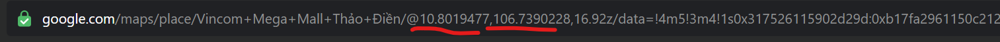
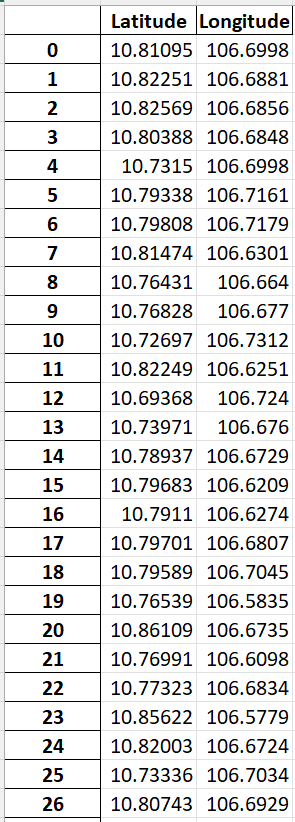

# Sử dụng thuật toán K-mean trên tọa độ các ngôi nhà đang bán trên trang nhà tốt

## _Link website: https://www.nhatot.com_

Dữ liệu địa chỉ nhà được cào từ web site nhatot.com

- BeautifulSoup4 để parse code html
- Sử dụng Selenium để lấy html của web (đây là web động)

Sau khi cào dữ liệu về sẽ được lưu vào file txt các địa chỉ. Các địa chỉ này sau đó sẽ được đưa lên _google maps_ để thực hiện việc trích xuất tọa độ

- Sử dụng Selenium tự động hóa việc nhập địa chỉ từ file txt có sẵn rồi đưa lên thanh search của _google maps_ rồi ấn Enter

Từ đó, ta có 1 danh sách các tọa độ

